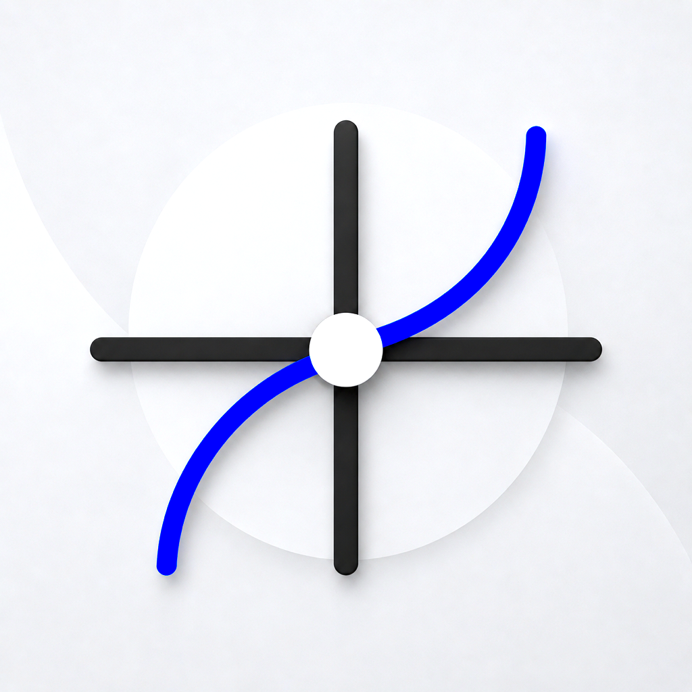
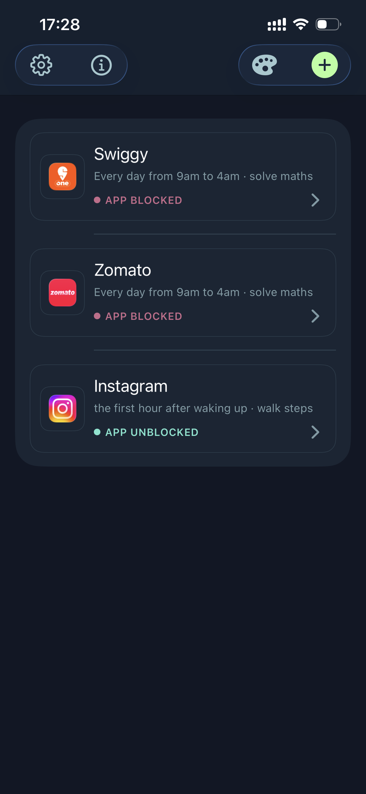
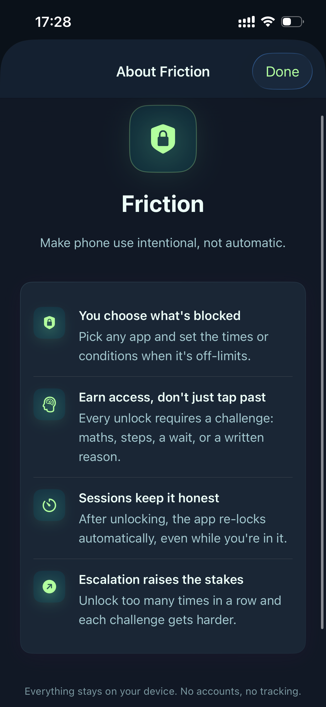

<p align="center">
  
</p>

<h1 align="center">Friction</h1>

<p align="center">
  <strong>Make phone use intentional, not automatic.</strong>
</p>

<p align="center">
  An iOS Screen Time app that <em>blocks</em> distracting apps — then makes you <em>earn</em> them back<br/>
  with maths, steps, waiting, or writing your reason out loud.
</p>

<p align="center">
  
  
  
  
</p>

<p align="center">
  <a href="#why-friction-matters-in-india">Why India</a> ·
  <a href="#the-product">Product</a> ·
  <a href="#how-it-works">How it works</a> ·
  <a href="#built-with-claude">Built with Claude</a> ·
  <a href="#architecture">Architecture</a> ·
  <a href="#run-it">Run it</a>
</p>

---

## The pitch in one screen

<table>
  <tr>
    <td width="50%" align="center">
      
      <br/>
      <sub><b>Rules that actually stick.</b><br/>Food apps blocked 9am→4am. Instagram locked for the first hour after waking.</sub>
    </td>
    <td width="50%" align="center">
      
      <br/>
      <sub><b>Earn access. Don't just tap past.</b><br/>Challenges, sessions, escalation — privacy stays on your phone.</sub>
    </td>
  </tr>
</table>

---

## Why Friction matters in India

India doesn't have a "screen time problem" in the abstract.

It has **food delivery at midnight**, **Reels until 3am**, **doomscroll before the first meeting**, and apps designed to remove every ounce of friction between desire and open.

Most blockers fail the moment willpower does — one "Just once" tap and you're back in.

**Friction flips that.**

| Without Friction | With Friction |
|---|---|
| Open Swiggy without thinking | Solve maths first |
| Scroll Instagram in bed | Walk steps after waking |
| "Pause blocking" forever | Temporary session → auto re-lock |
| Data about your habits on someone else's server | Everything on-device. No accounts. No tracking. |

This isn't another digital-wellness PDF.
It's **enforcement that lives inside Apple's Screen Time stack** — the same APIs parents use, turned into a personal behavioral contract.

---

## The product

### 1. You choose what's blocked
Pick any app. Attach conditions when it's off-limits:

| Condition | Example |
|---|---|
| **Time window** | Every day, 9am → 4am |
| **After waking up** | First hour after sleep |
| **Before sleep** | 90 minutes before your sleep target |
| **Daily open limit** | Soft-lock after N opens today |

### 2. Earn access — don't just tap past
Every unlock is a challenge, ordered by difficulty:

| Challenge | What it forces |
|---|---|
| ✍️ **Write your reason** | Slow down. Name the impulse. |
| ⏳ **Wait it out** | Sit with the urge until it cools |
| 🧮 **Solve maths** | Break the automatic open-loop |
| ⌨️ **Type a sentence** | Paste disabled. Attention required. |
| 🚶 **Walk steps** | Stand up. Leave the scroll. **Hardest by design.** |

### 3. Sessions keep it honest
Complete a challenge → temporary access → **the app re-locks on its own**, even while you're still inside it.

### 4. Escalation raises the stakes
Unlock too many times in a short window and challenges scale up (more steps, harder maths, longer waits). The system remembers when you try to outsmart yourself.

### 5. Deleting a rule is supposed to hurt
60-second cool-down. Then type a long, emotional confirmation phrase — paste blocked.
If leaving is easy, the product is theater.

---

## How it works

```
┌─────────────┐     Screen Time APIs      ┌──────────────────────────┐
│  Friction   │ ─────────────────────────▶│ ManagedSettings shields  │
│  (main app) │                           │ DeviceActivity schedules │
└──────┬──────┘                           └────────────┬─────────────┘
       │                                               │
       │ App Group UserDefaults                        │
       │ (rules, wake signals, session expiry)         │
       ▼                                               ▼
┌─────────────────────┐                     ┌──────────────────────┐
│ FrictionGateMonitor │  intervalDidStart   │ FrictionGateShield   │
│ DeviceActivity      │  intervalDidEnd     │ Shield UI + action   │
│ extension           │  eventDidReach…     │ "Switch to Friction" │
└─────────────────────┘                     └──────────────────────┘
```

**The non-negotiable product rule:** an app stays blocked if *any* active condition across *any* rule for that app still requires it. Interval ends don't blindly unmute. Shields recompute from first principles.

A wake-window DeviceActivity schedule proxies morning blocks so rules can enforce even when Friction isn't opened the second you wake up — within the limits Apple gives third-party apps.

---

## Built with Claude

Friction was designed and shipped as a **Claude + human pairing**: product judgment from life in India; systems implementation with Claude across architecture, Screen Time edge cases, SwiftUI polish, and enforcement hardening.

| Layer | What Claude co-built |
|---|---|
| **Architecture** | Rule model, App Group persistence, extension boundaries |
| **Enforcement** | Non-circular shield recompute, wake-window proxy, session relock |
| **Product friction** | Escalation, challenge difficulty tiers, delete cool-down UX |
| **Craft** | Dark theme system, contrast-aware accents, onboarding copy |

> **Anthropic alignment:** helpful (helps people regain agency), harmless (no surveillance, no accounts), honest (doesn't pretend willpower is a feature — puts friction in the path instead).

If you're judging for **India builds with Claude**: this repo is a working iOS product, not a slide deck — Screen Time extensions, HealthKit steps, on-device storage, and a UI you'd ship.

---

## Architecture

```
FrictionGate/
├── FrictionGate/                 # Main app (SwiftUI · MVVM)
│   ├── Models/                   # Rule, BlockCondition, UnlockChallenge, AppSettings
│   ├── Persistence/              # RuleStore → App Group UserDefaults
│   ├── Services/                 # BlockingService, DeviceActivityService, WakeUpDetector, StepMonitor
│   ├── ViewModels/               # Home, RuleBuilder, Unlock, WakeUp
│   └── Views/                    # Home · Builder · Unlock · Onboarding · Themes
├── FrictionGateMonitor/          # DeviceActivityMonitor extension — schedules & thresholds
├── FrictionGateShield/           # Shield UI when a blocked app is opened
└── FrictionGateShieldConfig/     # Shield configuration extension
```

### Stack

| Piece | Choice |
|---|---|
| UI | SwiftUI |
| Pattern | MVVM + Combine |
| Blocking | `FamilyControls` · `ManagedSettings` · `DeviceActivity` |
| Steps | HealthKit (+ CoreMotion fallback) |
| Persistence | App Group `UserDefaults` (shared with extensions) |
| Privacy | No backend · no accounts · no analytics SDK |

Minimum **iOS 16**. Requires Apple's **Family Controls** entitlement.

---

## Run it

```bash
git clone git@github.com:debraj-pal149/friction_gate.git
cd friction_gate
open FrictionGate.xcodeproj
```

1. Select the **FrictionGate** scheme.
2. Sign all targets with your team (`FrictionGate`, `Monitor`, `Shield`, `ShieldConfig`).
3. Ensure App Group `group.com.debrajpal.frictiongate` is enabled on every target.
4. Family Controls entitlement must be approved for your Apple Developer account.
5. Build to a **physical device** — Screen Time APIs are unreliable / limited on Simulator.

> Tip: when debugging long attach stalls in Xcode, try unchecking **Debug executable** under Scheme → Run → Info. Production App Store builds are unaffected.

---

## What "done" looks like (demo path)

1. Add rules for **Swiggy / Zomato** → time window + maths.
2. Add **Instagram** → first hour after waking + walk steps.
3. Leave Friction. Open the food app → shield appears → Switch to Friction → complete challenge → session starts.
4. Wait for session expiry (or force relock) → shield returns **even if the app is still open**.
5. Try deleting a rule → cool-down + long typed confession. Notice how hard it is to quit.

That loop is the whole thesis: **desire should meet resistance.**

---

## Roadmap / future potential

Friction is V1 of a category, not a one-off hack:

- **Smarter wake detection** within Apple's constraints
- **Shared / accountability modes** (partner sees streaks — still on-device first)
- **Challenge packs** tuned to Indian context (language, humour, local habits)
- **Focus modes** that compose rules across work / sleep / exam seasons
- **App Store** distribution once Family Controls production review is complete

The India wedge is clear: delivery apps + short video + late nights. The moat is enforcement quality, not another tip list.

---

## Privacy, explicitly

> Everything stays on your device. No accounts, no tracking.

Rules, unlock attempts, wake timestamps, and shield state live in an App Group on the phone. There is no Friction server that sees what you block.

---

## Credits

Built by **Debraj Pal** · AI pair-programmed with **Claude**.

<p align="center">
  
  &nbsp;&nbsp;
  
</p>

<p align="center">
  <sub>Friction — make phone use intentional, not automatic.</sub>
</p>
